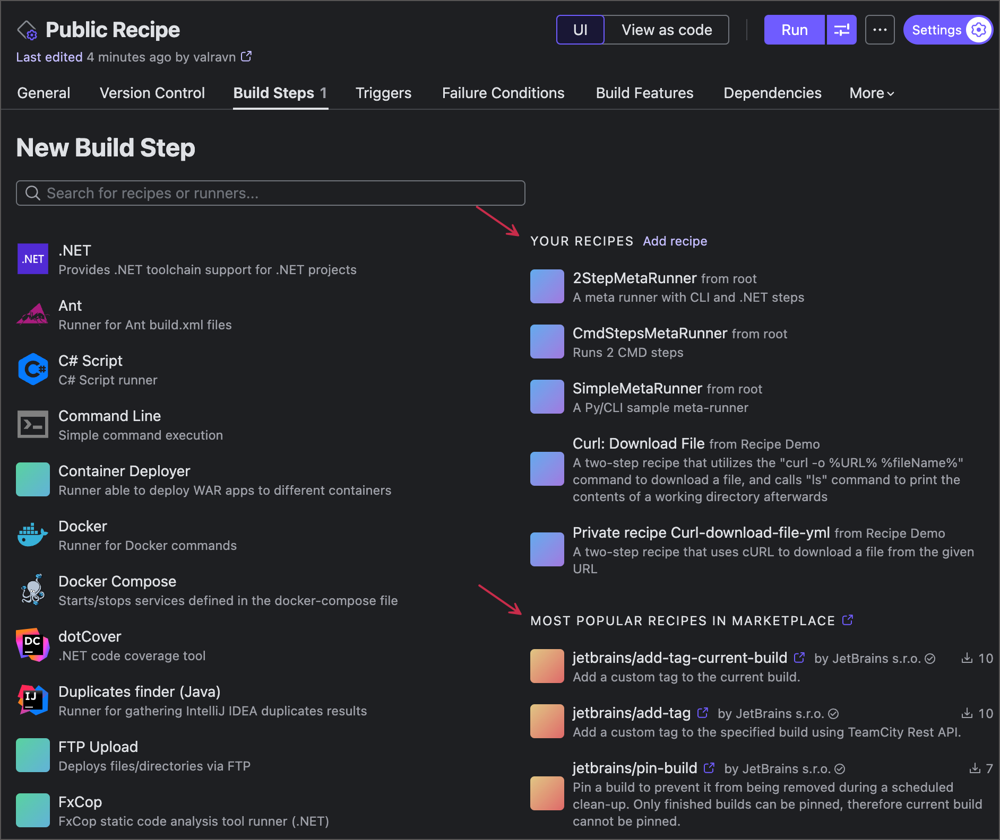

# TeamCity Recipes

Recipes are custom build steps based on one or multiple standard TeamCity steps. 
In this repository you can find ready-to-use public [YAML](yaml-specification/TeamCity%20Recipes%20YAML%20format%20specification.md) recipes published to [JetBrains Marketplace](https://plugins.jetbrains.com/teamcity_recipe).

## Use a recipe
Recipes are custom build steps, and as such, are added to build configurations in the same manner.

1. Open configuration settings and navigate to the Build steps settings tab.
2. Click the Add build step button.
3. Choose a recipe from the right column that shows:
   - local recipes owned by this project or its parent project;
   - public recipes from JetBrains Marketplace.
     
4. Set up required recipe settings in the same manner you do this for regular TeamCity steps.

## Recipes catalog

### [add-to-path](src/add-to-path/README.md) (Service message)
Temporarily prepends a specified directory to the PATH environment variable during the build process, ensuring its executables take precedence.

### [aws-cli-docker](src/aws/aws-cli-docker/README.md) (Bash script with custom Docker image)
Runs AWS CLI command from Docker container.

### [build-godot-game](src/build-godot-game/README.md) (Bash script with custom Docker image)
Recipe example based on article content from [JetBrains Blog](https://blog.jetbrains.com/teamcity/2024/10/automating-godot-game-builds-with-teamcity/).

### [create-file](src/create-file/README.md) (Kotlin Script)
Creates a text file with the specified content at the given path.
The directory is created automatically if it does not exist.

### [dagger](src/dagger/README.md) (Kotlin Script)
Installs the Dagger CLI and then optionally runs a Dagger command.

### [download-file](src/download-file/README.md) (Kotlin Script)
Downloads a file from the specified URL to the given directory.
Supports bearer authentication, as well as custom headers.

### [install-aws-cli](src/aws/install-aws-cli/README.md) (Kotlin Script)
Installs the AWS Command Line Interface (CLI) on the agent, allowing subsequent build steps to call the “aws” command.

### [import-xml-report](src/import-xml-report/README.md) (Service Message)
Imports an XML test report.
Supports JUnit, Surefire, NUnit, and VSTest formats.

### [pin-build](src/pin-build/README.md) (REST API)
Pins the specific build to prevent it from being removed during a scheduled clean-up.
Can only pin a finished build.
This recipe utilizes TeamCity REST API and requires Token-Based Authentication credentials.

### [publish-artifacts](src/publish-artifacts/README.md) (Service message)
Publishes build artifacts immediately after they are built, while the build is still running.

### [send-email](src/send-email/README.md) (Service message)
Sends a custom email from a build step.
Requires a configured SMTP server (Admin | Email Notifier in TeamCity UI) with the “Notifications limit” property greater than 0.

### [send-slack-message](src/send-slack-message/README.md) (Service message)
Sends a Slack notification.
Requires a project that has a configured Slack connection with Notifications limit greater than 0.

### [set-build-status](src/set-build-status/README.md) (Service message)
Sets the build status to successful or failed. The status persists after the build completes.

### [set-environment-variable](src/set-environment-variable/README.md) (Service message)
Sets an **environment variable**.  
If the variable does not exist in the environment, it will be **created**.

### [setup-bazelisk](src/setup-bazelisk/README.md)
Installs bazelisk on the agent, allowing subsequent build steps to call the “bazel” command.

### [setup-node](src/setup-node/README.md)
Installs Node.js on the agent, allowing subsequent build steps to call the “node” command.

### [tag-current-build](src/tag-current-build/README.md) / [untag-current-build](src/untag-current-build/README.md) (Service message)
Tags the current build.
If you need to tag specific builds by their IDs, use the 'tag-build' recipe instead.

### [tag-build](src/tag-build/README.md) (REST API)
Tags a specific TeamCity build. Locates the build to tag by the given build ID.
To tag the current build instead, use the 'tag-current-build' recipe.
This recipe utilizes TeamCity REST API and requires Token-Based Authentication credentials.

## Dev quickstart
To build recipes run:
```bash
./gradlew recipes
```

Running this command produces the finalized recipe files in `.teamcity/pluginData/_Self/metaRunners`.

The resulting `.yml` files can be used for:
1. Publishing to [JetBrains Marketplace](https://plugins.jetbrains.com/teamcity_recipe).
2. Local testing by uploading the files as private (local) recipes in TeamCity.

To run tests Docker is required. The command:
```bash
./gradlew clean test